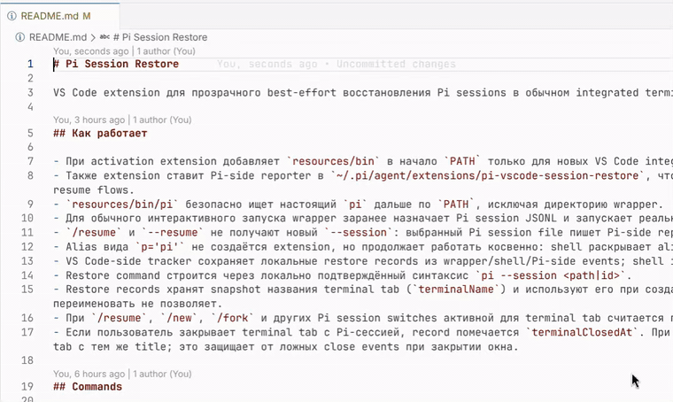

# Pi Session Restore

VS Code extension for best-effort Pi session restore in regular integrated terminals.

[Русская версия](./README.ru.md)

## Demo

[Open the MP4 demo](./resources/demo/pi-session-restore-demo.mp4) for the higher-quality version.

## How it works

- On activation, the extension prepends `resources/bin` to `PATH` only for new VS Code integrated terminals through `ExtensionContext.environmentVariableCollection`.
- It also installs a Pi-side reporter into `~/.pi/agent/extensions/pi-vscode-session-restore`, so Pi can report authoritative `session_start` events after `/resume`, `/new`, `/fork`, and CLI resume flows.
- `resources/bin/pi` safely finds the real `pi` later in `PATH`, excluding the wrapper directory itself.
- For normal interactive launches, the wrapper assigns a Pi session JSONL file in advance and starts the real CLI as `pi --session <path> ...`; explicit session, resume, print, and package commands are not rewritten.
- `/resume` and `--resume` do not receive a new `--session`: the selected Pi session file is written to the shared event log by the Pi-side reporter.
- Aliases such as `p='pi'` are not created by the extension, but continue to work indirectly: the shell expands the alias to `pi`, then the PATH wrapper is used.
- The VS Code-side tracker stores local restore records from wrapper, shell, and Pi-side events; shell integration is used as an additional best-effort source.
- Restore commands are built with the locally verified syntax `pi --session <path|id>`.
- Restore records store a snapshot of the terminal tab name (`terminalName`) and use it when creating new restore terminals. The public VS Code API cannot rename existing shell-backed terminals.
- After `/resume`, `/new`, `/fork`, and other Pi session switches, the active session for a terminal tab is the latest `sessionPath`; the previous session is marked inactive through `terminalClosedAt`.
- If a user closes a terminal tab with a Pi session, the record is marked with `terminalClosedAt`. During startup auto-restore, such a record is used only when VS Code actually restored a terminal tab with the same title. This avoids false close events when the window itself was closed.

## Commands

- `Pi Session Restore: Show Records`
- `Pi Session Restore: Clear Records`
- `Pi Session Restore: Restore Last Session`

## Settings

- `piSessionRestore.enabled`: enables the PATH wrapper for new terminals.
- `piSessionRestore.sessionGlobPaths`: glob paths for session JSONL files, defaulting to `~/.pi/agent/sessions/**/*.jsonl`.
- `piSessionRestore.restorePolicy`: `off`, `prompt`, or `auto-confident`; defaults to `auto-confident`.
- `piSessionRestore.confidenceThreshold`: `high`, `medium`, or `low`.
- `piSessionRestore.diagnosticsLevel`: `off`, `error`, `info`, or `debug`.
- `piSessionRestore.recordTtlDays`: TTL for local records.
- `piSessionRestore.installPiExtension`: installs the Pi-side reporter for accurate `/resume` tracking; enabled by default.

## Privacy

The extension stores only local diagnostic events from the wrapper and Pi-side reporter, plus restore records in VS Code `globalStorageUri`. Session contents are not copied. With `piSessionRestore.diagnosticsLevel=debug`, the `Pi Session Restore` output channel also shows workspace scope, discovered terminals, auto-restore candidates, and skip reasons.

## Known limitations

- Does not restore a live terminal process.
- Does not support tmux, Remote SSH, WSL, or Dev Containers.
- Auto-restore is intentionally conservative: it works only with `restorePolicy=auto-confident`, high-confidence records, and a known workspace scope. It restores into an existing idle terminal only when the terminal title matches a saved Pi record title or VS Code shell integration reports a compatible terminal cwd.
- Auto-restore first uses idle terminal tabs restored by VS Code itself. If VS Code restores fewer tabs than the number of previously auto-restored Pi records for that workspace, the extension creates missing tabs only for those previously restored records. Ordinary idle terminals without a matching title or explicit cwd signal are skipped instead of receiving a time-based fallback record.
- Terminal tab names are best-effort: the VS Code API allows reading `Terminal.name`, but does not publicly expose renaming for existing shell-backed terminals.
- VS Code shell integration can be unavailable; in that case the extension uses the wrapper/Pi event log and the fallback `terminal.sendText` path for manual restore commands.
